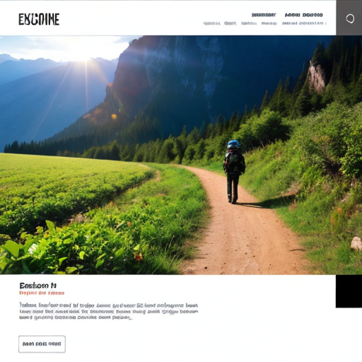

ЦC: https://github.com/k-mesavage/java-explore-with-me/pull/6

Java 11, Spring Boot, Spring Data, Lombok, Spring Jpa, PostgreSQL, Hibernate ORM, Docker.

Explore With Me:  

  

One-board service for explore locations and enjoy funny time!

•Find event  
•Send request  
•Like it
•Comment    
TODO: •Auth
  

Docker-compose.yml ready to start.
